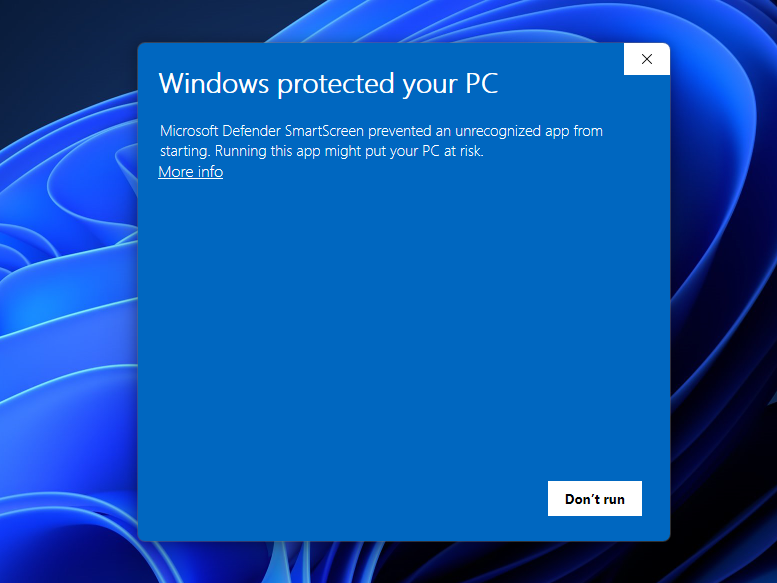

# Typing Bongo Cat

Typing Bongo Cat is a widget that shows a bongo cat and she types with you. It supports your mental health and makes you feel better.

## Installation
Binaries are regularly built and are available at [Release page](https://github.com/hurokume/Typing-Bongo-Cat/releases/latest).
- If the security warning appears as shown below, click "More info" and then "Run anyway". After finishing the download, unzip the file and run `Typing Bongo Cat.exe`.
- If you launch the application for the first time, you may see a security warning and you may need to wait for a while (10 sec. - 1 min.) until the application is launched.

## Special Thanks
- [StrayRogue](https://twitter.com/strayrogue) for the original idea and the design of the bongo cat. You can find the original design [here](https://x.com/StrayRogue/status/992994454058381312?ref_src=twsrc%5Etfw%7Ctwcamp%5Etweetembed%7Ctwterm%5E993487015499853824%7Ctwgr%5E4e24adc361e7b41e380410f3030f9fda62969e69%7Ctwcon%5Es2_&ref_url=https%3A%2F%2Fmashable.com%2Farticle%2Fbongo-cat-twitter-meme).
- [JohnnyRacket](https://github.com/JohnnyRacket) developed the VSCode extension [Bongo Cat Buddy](https://github.com/JohnnyRacket/bongocat-vscode-ext) and our application is inspired by his work.